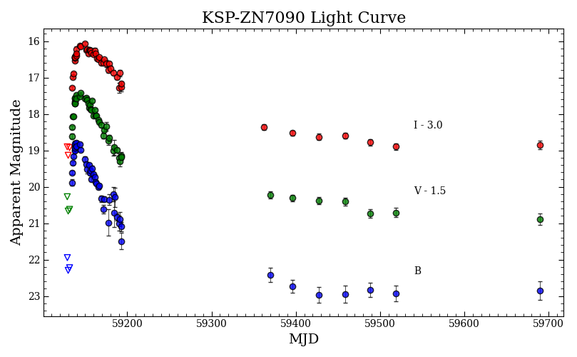

# KSP-ZN7090-2020f Peculiar Ultra-Luminous Supernova
Pyhton scripts and routines used in the upcoming publication for studying young supernova detected by the Korean Microlensing Telescope Network. This repository serves as an archive for all the techinques I've developed for studying said event. I would draw attention to the script `ZN7090_MCMC_Log.py` in the `Scripts` folder where I use the thermonuclear shock breakout model from [Morag et. al. (2023)](https://academic.oup.com/mnras/article/522/2/2764/7086123) to conduct a simultaneous mulit-band fit to determine the progenitor parameters of the supernova. This script calls on the auxilary functions from `Helpers.py` and `MCMC_Routines.py` to transform the data and modularize the code.

    

### Discovery and Early Photometry
ZN7090 was first detected on 2020 October 12 at 14:44 UTC as part of the KMTNet Supernova Program. The KMTNet is a network of three 1.6m telescopes located in Chile, Africa, and Australia, providing 24 hr continuous
sky survey. The Korean Supernova Program conducts high-cadence BVI monitoring of a sample of fields and focuses on studying early SNe and rapidly evolving transients.

    

### Bolometric Light Curve
To construct bolometric light curves for KSP-ZN7090-2020f we apply the bolometric corrections from [Lyman et. al. 2013](https://academic.oup.com/mnras/article/437/4/3848/1011706?login=false) for the early light curve color range and [Martinez et. al. 2022](https://www.aanda.org/articles/aa/full_html/2022/04/aa42075-21/aa42075-21.html) for the radioactive tail phase colors.

    

### Spectral Analysis
We collected three spectrums for ZN7090 with the Gemini-South observatory during the early shock breakout phase, early, and late nebula phase. For the early light curve and early nebula we used a R400 grating
and for the late stage we used a B600 grating. In the early spectra we identify a possible P-Cygni Hα profile indicating the presence of out-flowing ionized hydrogen, which is characteristic for Type II SNe Overlapped on this broad feature is the host galaxy’s Hα emission, which we see persist throughout the spectroscopic evolution of the SN.

    

### Preliminary Ligth Curve Analysis
We estimate the epoch of first light by conductin a simultaneous power-law fit on the monochromatic light curves as done in [Gonzalez-Gaitan et. al. 2015](https://academic.oup.com/mnras/article/451/2/2212/1749558)

    

### Shock Breakout and Progenitor Parameters
The short rise time for ZN7090 suggest that the observed emissions are due to a shock breakout cooling mechanism. The properties of the early breakout cooling emission carry unique signatures regarding the structure of the progenitor star. In order to model the multi-band emissions from KSP-ZN7090 we used the analytical models from [Sapir & Waxman 2017](https://iopscience.iop.org/article/10.3847/1538-4357/aa64df), [Matzner & McKee](https://iopscience.iop.org/article/10.1086/306571) and [Morag et. al. (2023)](https://academic.oup.com/mnras/article/522/2/2764/7086123). 

    

We chose to adopt a Bayesian approach of maximum likelihood estimation (MLE) instead of a frequentist because we wish to reduce the number of assumption made on the underlying nature of the data. We also want to explore the parameter space of such model given our data, and obtain a deeper understanding of the errors in the parameters. The median of the parameter distribution and the highest likelihood parameters produced light curves that over-estimate the BV observed spectral fluxes of ZN7090. This overestimate could be cause by not correcting for host galaxy extinction, which in principle would affect the BV bands more than the i band.